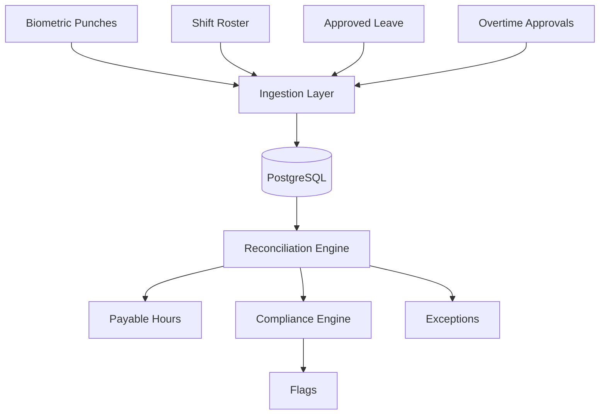
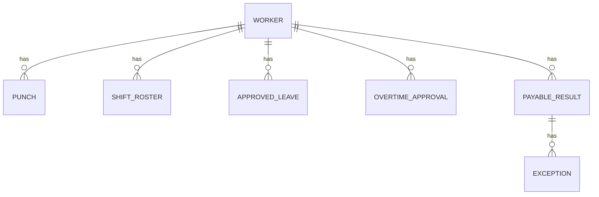

# Attendance & Shift Compliance — Design Document

## 1. Architecture Overview

The system is designed as a modular FastAPI application backed by PostgreSQL.



The main processing stages are:

1. Ingestion — validate and store the four sources.
2. Reconciliation — combine source data and calculate payable hours.
3. Compliance — apply the configured compliance rules.
4. Results — provide payable hours, flags, and exceptions.

A modular monolith is used instead of microservices because the project does not require distributed deployment. This keeps the system simpler to develop, test, and operate.

---


## 2. Data Model

The main entities and their relationships are:



PostgreSQL is used because the four input sources have clear relationships through workers, dates, and shifts, and reconciliation requires combining information across these sources.

---

## 3. Reconciliation Design

For each worker and work date, the reconciliation engine evaluates:

```text
Roster
   +
Punches
   +
Leave
   +
Overtime
   ↓
Payable Hours
   +
Flags / Exceptions
```

The engine:

1. Validates and normalizes source data.
2. Removes duplicate punches using a configurable time threshold.
3. Pairs valid IN/OUT punches.
4. Handles overnight shifts using the rostered work date.
5. Checks attendance against approved leave.
6. Compares work beyond the roster with overtime approvals.
7. Calculates payable hours when the working interval can be determined safely.
8. Creates flags or exceptions where required.

The reconciliation logic is kept separate from the API layer so it can be unit tested independently.

---

## 4. Key Design Decisions & Trade-offs

### Missing Punches

**Constraint:** Workers may forget to punch out. The system must not assume they worked until midnight or blindly apply the rostered shift length.

**Decision:** Treat an unresolved missing IN/OUT punch as an exception.

**Trade-off:** This may delay payment for an unresolved record, but prevents invented hours and reduces the risk of overpayment.

### Duplicate Punches

**Constraint:** Duplicate punches seconds apart are common at shared terminals.

**Decision:** Deduplicate punches within a configurable time interval.

**Trade-off:** This handles common terminal duplicates without hardcoding the threshold into the reconciliation logic.

### Overtime

**Constraint:** Overtime may be worked without prior approval and must not be silently paid or dropped.

**Decision:** Compare actual worked time with overtime approvals and surface unapproved overtime.

**Trade-off:** The system does not automatically treat unapproved overtime as approved, while still making the work visible for review.

### Overnight Shifts

**Constraint:** Shifts can cross midnight and must be attributed to the correct day.

**Decision:** Use the rostered/work date when associating punches with an overnight shift rather than simply grouping punches by calendar date.

### Compliance Rules

**Constraint:** Only two compliance rules are required and they must be configurable.

**Decision:**

```text
MAX_CONTINUOUS_SHIFT_HOURS = 10
MAX_CONSECUTIVE_WORKING_DAYS = 6
```

The reconciliation logic does not hardcode these values.

### Flags vs Exceptions

**Constraint:** A flag means the hours are payable, while an exception means the result should not be paid until resolved.

**Decision:** Represent flags and exceptions separately.

Example:

```text
Shift > 10 hours
    → Payable
    → Compliance Flag

Missing OUT punch
    → Unresolved
    → Exception
```

---

## 5. Ground Truth & Re-runnability

The synthetic data generator first creates a known-correct set of shifts. Punch data is then generated from these shifts with controlled errors such as missing and duplicate punches.

The computed results can therefore be compared against the known ground truth to validate the reconciliation logic.

The same pay period can also be processed repeatedly without creating duplicate payable results or exceptions. This allows corrected source data to be reprocessed safely.

---

## 6. Scope

The following are intentionally excluded:

Real external biometric, HR, leave, and payroll integrations because the project requires simulated sources.

Frontend and supervisor approval UI because they are explicitly outside the project scope.

Payroll payment execution because the service only calculates payable hours.

Labour-law research because only the two compliance rules supplied in the brief are required.

Automatic resolution or approval of exceptions because uncertain attendance data must be surfaced for review.

---

## 7. Summary

The architecture prioritizes correctness, traceability, and safe handling of uncertain attendance data over unnecessary complexity.

The main design principle is:

> **Do not invent working hours when the available source data cannot safely establish them.**
