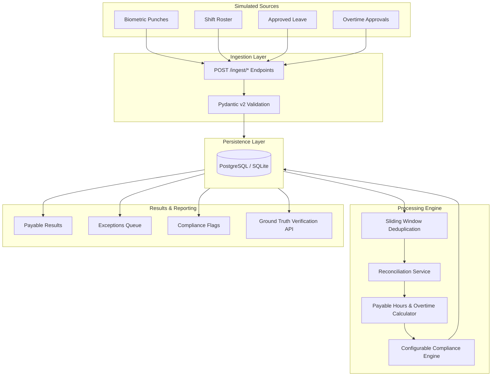
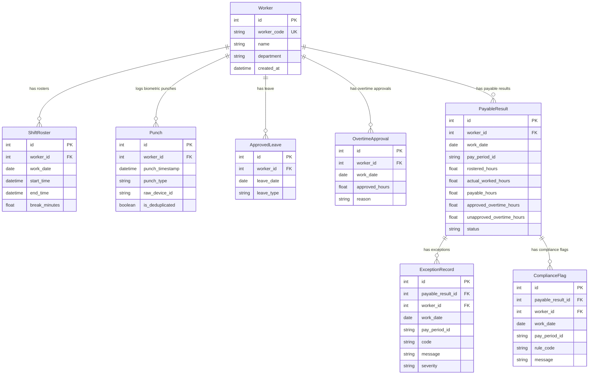

# Architecture & Design Document

## 1. High-Level Architecture

The **Attendance & Shift Compliance Service** follows a modular monolith architecture. Data flows unidirectionally from simulated data sources through ingestion and validation layers into persistent storage, followed by business processing engines for deduplication, attendance reconciliation, payable hours computation, compliance rule evaluation, and final results reporting.

---

## 2. Data Model Design

The database schema utilizes strict foreign keys, indexes on queried fields, and composite unique constraints to enforce data integrity.

---

## 3. Reconciliation & Key Design Decisions

### 3.1. Deduplication Service
Biometric punch hardware often transmits multiple signals within seconds due to retry loops or repeated touch inputs.
- **Implementation**: Sliding time window deduplication configured by `DEDUPLICATION_WINDOW_SECONDS` (Default: 60 seconds).
- **Behavior**: Punches of identical type (`IN` or `OUT`) occurring within 60 seconds of a previously recorded punch are tagged `is_deduplicated = True` and excluded from reconciliation.

### 3.2. Overnight Shift Handling
Shifts spanning midnight (e.g. Aug 5 22:00 to Aug 6 06:00) must be correctly attributed to the rostered work date (Aug 5).
- **Implementation**: Punches are evaluated within a candidate window around the rostered shift `[start_time - 4h, end_time + 4h]`.
- **Outcome**: The entire 8-hour shift is bound to `work_date = Aug 5`, preventing calendar-date splitting errors.

### 3.3. Missing Punch Policy Justification
When an `IN` or `OUT` punch is missing:
- **Policy**: The system **MUST NOT** assume the worker worked until midnight, blindly apply rostered hours, or invent missing punch timestamps.
- **Rationale**: Biometric punch data is the legal basis for hourly compensation. Inventing punches risks paying unworked hours or violating labor agreements.
- **System Action**: An `ExceptionRecord` (`MISSING_IN` / `MISSING_OUT`) is generated, and `payable_hours` is set to `0.0` for the unverified shift pending supervisor review.

### 3.4. Flags vs. Exceptions Distinction

| Feature | Definition | System Action | Example |
| :--- | :--- | :--- | :--- |
| **Compliance Flag** | Payable hours CAN be safely established, but a workplace rule threshold is triggered. | Record payable hours normally; surface flag for compliance audit. | Worker worked an 11-hour continuous shift (Flag: `MAX_CONTINUOUS_SHIFT_HOURS`). |
| **Exception** | Payable hours CANNOT be safely established, or unapproved hours require manager decision. | Hold or withhold unverified payable hours; route to review queue. | Worker missing OUT punch (Exception: `MISSING_OUT`) or worked 2h unapproved OT (Exception: `UNAPPROVED_OVERTIME`). |

### 3.5. Configurable Compliance Engine
Compliance parameters are loaded from environment settings (`Settings`) rather than hardcoded:
- `MAX_CONTINUOUS_SHIFT_HOURS`: Triggers `MAX_CONTINUOUS_SHIFT_HOURS` flag if actual shift duration > 10.0 hours.
- `MAX_CONSECUTIVE_WORKING_DAYS`: Triggers `MAX_CONSECUTIVE_WORKING_DAYS` flag on the 7th+ consecutive day with worked hours > 0.

### 3.6. Idempotent & Re-runnable Processing
- Re-executing `POST /api/v1/periods/{period_id}/process` executes inside a database transaction that purges previous results, exceptions, and flags for `pay_period_id` before recomputing.
- Composite unique constraint `(worker_id, work_date, pay_period_id)` on `PayableResult` enforces database-level uniqueness.

### 3.7. Ground-Truth Validation Strategy
- The synthetic generator produces an explicit `ground_truth` mapping of expected payable hours, exceptions, and flags for each worker + date.
- The `/api/v1/ground-truth/compare` endpoint validates DB output against expectations and returns an exact accuracy percentage.

---

## 4. Future Improvements

1. **Biometric Hardware & Webhook Integrations**:
   Support direct MQTT or webhook streaming of punch logs with cryptographic payload signatures.
2. **Supervisor Approval Workflow**:
   Build API endpoints allowing supervisors to resolve exceptions by providing manual punch overrides with audit logging.
3. **Role-Based Access Control (RBAC)**:
   Add JWT-based authentication separating Worker, Supervisor, and Auditor roles.
4. **Large-Scale Batch Processing**:
   Offload pay period processing for thousands of workers to asynchronous Celery/Redis background worker queues.
